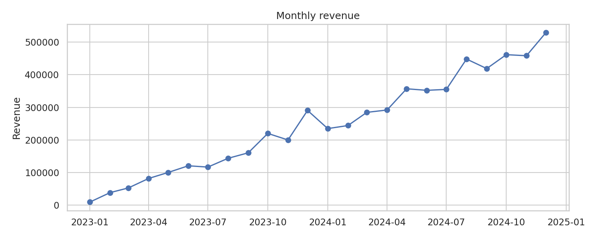
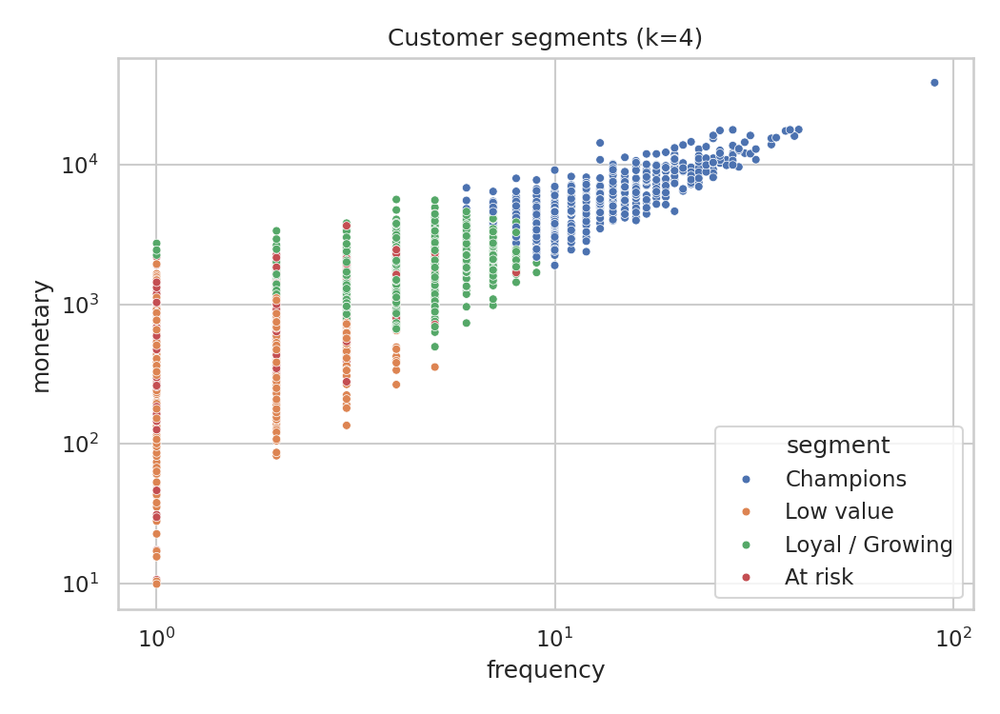
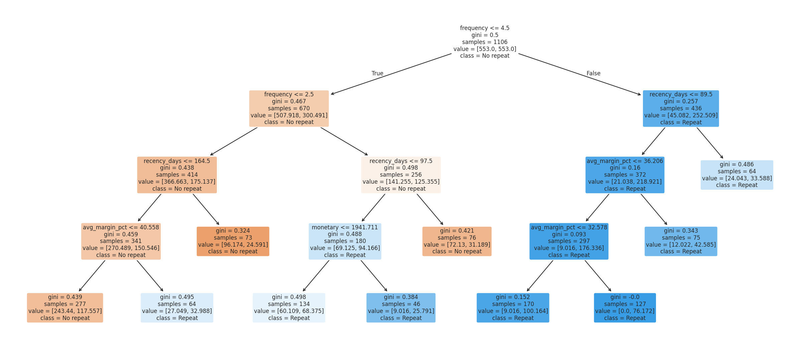
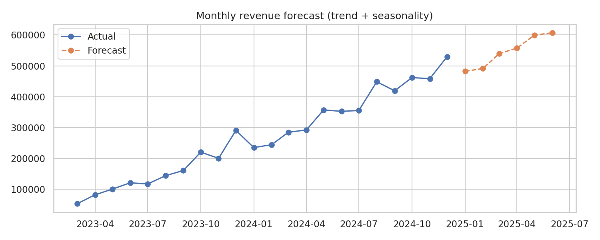

# EDA, Customer Segmentation & Forecasting with Python and SQL

End-to-end analytics project on a retail transactions database: SQL for extraction and KPI
aggregation, Python (Pandas, NumPy, SciPy, scikit-learn) for cleaning, statistical analysis,
customer segmentation, decision-tree modelling and revenue forecasting.

> **Data note:** the dataset is **synthetic** (generated by `src/generate_data.py`, seed 42) so the
> project is fully reproducible and contains no confidential data. The pipeline expects the table
> layout in `sql/schema.sql`, so real data can be dropped in without code changes.

## What this project does

| Stage | Where | What |
|---|---|---|
| Extraction & KPIs | `sql/` | Joins across 4 tables, date filters, `GROUP BY` KPI calculations (revenue, profit, margin, AOV), a customer RFM feature view |
| Data validation & governance | `src/analysis.py` | 9 automated checks (duplicates, nulls, out-of-range values, orphan keys, negative quantities, price < cost); results in `outputs/tables/data_quality_checks.csv` |
| Cleaning & transformation | `sql/01_order_lines_view.sql`, `src/analysis.py` | De-duplicate orders, cap invalid ages, median/“Unknown” imputation |
| EDA & statistical analysis | `src/analysis.py` | Distribution and correlation analysis, Welch t-test (channel), ANOVA + Kruskal-Wallis (region) |
| Customer segmentation | `src/analysis.py` | Log-scaled RFM + K-Means (k=4), named segments with revenue share |
| Decision-tree model | `src/analysis.py` | Predicts which customers buy again in the next 6 months; time-based split to avoid leakage |
| Forecasting | `src/analysis.py` | Trend + seasonality regression, 6-month holdout backtest, 6-month forecast |

## Key results

| Metric | Value |
|---|---|
| Orders / active customers | 13,829 / 2,107 |
| Revenue / profit / margin | 5.97M / 1.96M / 32.9% |
| Data quality issues found | 25 duplicate orders, 40 missing ages, 15 invalid ages, 30 missing regions |
| Online vs Store order value | Store orders are larger (469.8 vs 401.9, p < 0.001) |
| Order value by region | No significant difference (ANOVA p = 0.69) |
| Champions segment | 30% of active customers (641) generate 66% of revenue |
| At-risk segment | 230 customers, avg. 291 days since last order |
| Repeat-purchase tree | Hold-out AUC 0.68; order frequency is the dominant driver (importance 0.75) |
| Forecast backtest (6 months) | MAPE 5.5% vs 19.8% for a carry-last-value baseline |

The decision tree is deliberately shallow (depth 4) for interpretability; its modest AUC is
reported as-is. See `outputs/tables/tree_rules.txt` for the readable rules.

## Figures

| | |
|---|---|
|  |  |
|  |  |

## Project structure

```
├── data/                 # retail.db is created here (SQLite)
├── sql/                  # schema, order-line view, KPI queries, customer feature view
├── src/
│   ├── generate_data.py  # builds the synthetic database (with injected data-quality issues)
│   └── analysis.py       # full pipeline
├── outputs/
│   ├── figures/          # charts
│   ├── tables/           # CSV outputs, tree rules
│   └── summary.json      # all headline numbers
└── requirements.txt
```

## How to run

```bash
pip install -r requirements.txt
python src/generate_data.py   # creates data/retail.db
python src/analysis.py        # runs the pipeline, writes outputs/
```

## Skills demonstrated

SQL (joins, filters, GROUP BY, CTEs, views, KPI calculations) · Python, Pandas, NumPy · data
cleaning and validation · hypothesis testing · K-Means / RFM segmentation · decision trees
(scikit-learn) · time-series forecasting and backtesting · business storytelling from data.
